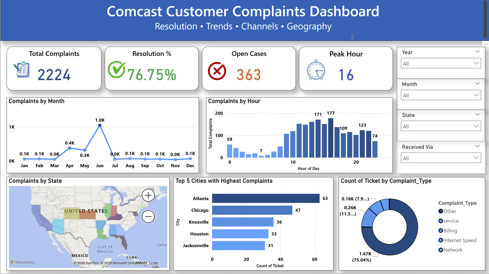
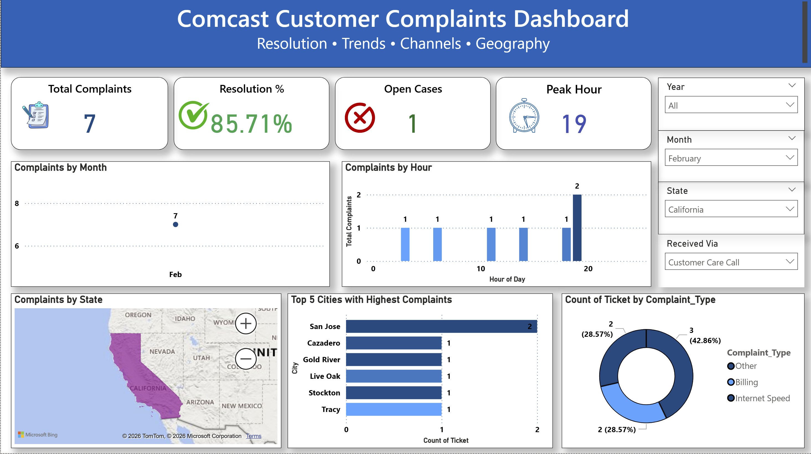

# 📊 Comcast Customer Complaints Analysis Dashboard

An interactive **Power BI dashboard** designed to analyze over **2,000+ customer complaints** and uncover actionable insights related to service issues, resolution performance, peak complaint periods, and geographic hotspots.

This project demonstrates end-to-end data analytics — from SQL-based data exploration to business intelligence visualization.

---

## 🚀 Project Overview

Organizations often collect large volumes of customer complaint data but struggle to extract meaningful insights from it. This project transforms raw data into an executive-friendly dashboard that enables faster and smarter decision-making.

The analysis focuses on identifying complaint trends, measuring operational efficiency, and highlighting regions requiring service improvements.

---

## 🎯 Key Objectives

- Analyze total complaint volume and resolution performance  
- Identify peak complaint hours for workforce optimization  
- Detect geographic regions with high complaint density  
- Understand major complaint categories  
- Build an interactive dashboard for dynamic exploration  

---

## 🛠 Tools & Technologies

- **Power BI** – Dashboard development & visualization  
- **SQL (MySQL)** – Data analysis and querying  
- **DAX** – Calculated measures and KPIs  
- **Data Cleaning & Modeling** – Ensuring structured and reliable data  

---

## 📊 Dashboard Preview

---

## 💻 SQL Analysis

The project incorporates SQL queries to perform exploratory data analysis before visualization.

Key analyses included:

- Complaint count by state  
- Resolution rate calculation  
- Peak complaint hour detection  
- Complaint type distribution  

---

## ⚡ Dashboard Features

✔ Executive KPI Cards (Total Complaints, Resolution %, Open Cases, Peak Hour)  
✔ Monthly and hourly complaint trend analysis  
✔ Geographic visualization of complaint hotspots  
✔ Top cities with highest complaints  
✔ Complaint type distribution  
✔ Interactive filters for dynamic exploration  
✔ Insight-rich tooltips  

---

## 🔍 Key Insights

- Complaint volume shows noticeable spikes during specific periods.
- Certain states experience significantly higher complaint frequencies.
- Internet-related issues account for a large portion of complaints.
- Peak hours highlight when support demand is highest.
- Resolution metrics indicate strong performance with opportunities for improvement.

---

## ✅ Business Recommendations

- Optimize staffing during high complaint periods  
- Strengthen infrastructure in high-risk regions  
- Streamline resolution workflows  
- Implement proactive service monitoring  

---

## 📁 Repository Structure

Comcast-Customer-Complaints-Analysis
│
├── Dashboard
│ └── comcast-complaints-dashboard.pbix
│
├── Dataset
│ └── comcast.csv
│
├── Images
│ ├── dashboard-preview.png
│ └── sql-analysis.png

## 👨‍💻 Author

**JD**

Aspiring Data Analyst passionate about transforming data into actionable insights and building decision-driven dashboards.

---

⭐ If you found this project insightful, feel free to star the repository!
